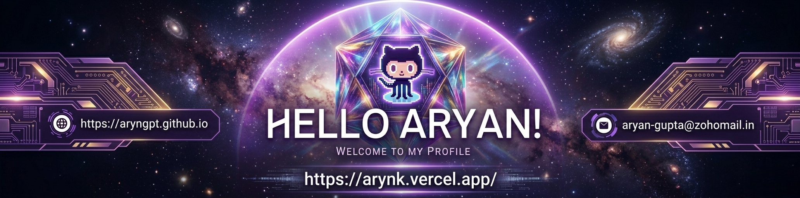

<!--Banner-->

<!--Night Owl image-->

  

<!--Header Name-->
#  ɪ'ᴍ ᴀʀʏᴀɴ! 
*Full-Stack Software & Automation Engineer*
  

<!--Start Intro-->               

I am an engineer based in Mau, Uttar Pradesh, specializing in building production web applications, custom vision-to-data parsing pipelines, and asynchronous automations designed to eliminate manual data entry, paper ledgers, and spreadsheet fragmentation.

- ✨ Class 11 Student at Little Flower International School with an **88% CBSE Board** profile.
- 🌱 Successfully removed up to 70% of manual work operational bottlenecks for active clients.
- 💁‍♂️ Architected transactional PostgreSQL row-locking layers to handle high-concurrency clinic workflows natively.
- 🏙 Processed, extracted, and audited 500+ unstructured print advertisements inside automated pipelines.
- ✍ Structured JSON extraction via OpenAI Pydantic schemas.
- ❤ Contributing to Open Source.
- 💻 Visit my [GitHub Profile](https://github.com/aryngpt) for more details about me.
<!--End Intro-->

<!--Profile Count Badge-->

  

---

<!--Languages and Tools Section-->       
<h2 align="center">Tᴇᴄʜ sᴛᴀᴄᴋ & Lᴀᴛᴇsᴛ ʙʟᴏɢs</h2> 
<picture>
  <source media="(prefers-color-scheme: dark)" srcset="./Skills_Animation_Dark.gif">
  <source media="(prefers-color-scheme: light)" srcset="./Skills_Animation_White.gif">
  
</picture>
 

<h3 align="left">Current Learning</h3>
<ul align="left">
  <li>Deepening semantic embeddings utilizing <code>pgvector</code> data structures.</li>
  <li>Refining edge function computing limits for heavy payload transfers.</li>
  <li>Optimizing system state isolation matrices within React 18.</li>
</ul>
  
<h3 align="left">Latest Blog Posts</h3>
<ul align="left">
  <li><a href="https://github.com/aryngpt/unmask">🔥Unmask Platform Infrastructure: Advanced OCR parsing pipelines running at < 5s latency 🤖</a></li>
  <li><a href="https://github.com/aryngpt/mau-care">🔥Mau Care Infrastructure: Pessimistic database locking (SELECT FOR UPDATE) 🙂</a></li>
  <li><a href="https://github.com/aryngpt">Offline-tolerant local data mutations with IndexedDB caching🤯</a></li>
</ul>
 
 
 
 

<!--Trophies Section-->   
<h2 align="center">🏆 Gɪᴛʜᴜʙ Tʀᴏᴘʜɪᴇs 🏆</h2>

  <a href="https://github.com/aryngpt">
    <picture>
      <source media="(prefers-color-scheme: dark)" srcset="https://github-profile-trophy-ruddy.vercel.app/?username=aryngpt&no-bg=true&row=2&column=6&margin-w=20&margin-h=20&theme=monokai">
      <source media="(prefers-color-scheme: light)" srcset="https://github-profile-trophy-ruddy.vercel.app/?username=aryngpt&no-bg=true&row=2&column=6&margin-w=20&margin-h=20">
      
    </picture>
  </a>

  

 

<!--Github stats Table--> 
<h2 align="center">📊 Gɪᴛʜᴜʙ Sᴛᴀᴛs 📊</h2>

<table width="100%">
  <tr>
    <td width="50%">
      <h3 align="center"><strong>Gɪᴛʜᴜʙ Sᴛᴀᴛs</strong></h3>
      

        
      

    </td>
    <td width="50%">
      <h3 align="center"><strong>Sᴛʀᴇᴀᴋ Sᴛᴀᴛs</strong></h3>
      

        
      

    </td>
  </tr>
  <tr>
    <td width="50%">
      <h3 align="center"><strong>Lᴀᴛᴇsᴛ Pʀᴏᴊᴇᴄᴛ</strong></h3>
      

        
      

    </td>
    <td width="50%">
      <h3 align="center"><strong>Tᴏᴘ Cᴏɴᴛʀɪʙᴜᴛɪᴏɴs</strong></h3>
      

        
      

    </td>
  </tr>
</table>
 

<!--Contribution Graph-->
<h2 align="center">📈 Cᴏɴᴛʀɪʙᴜᴛɪᴏɴ Gʀᴀᴘʜ 📈</h2>

    

---

<!--Dynamic Quote card updates everyday at 12 PM--> 
<h2 align="center">🌟 Tʜᴏᴜɢʜᴛ ᴏғ ᴛʜᴇ Dᴀʏ 🌟</h2>

<!--STARTS_HERE_QUOTE_CARD-->

    

<!--ENDS_HERE_QUOTE_CARD-->

<!--Contact Section--> 

<h2 align="center">🤝 Cᴏɴɴᴇᴄᴛ Wɪᴛʜ Mᴇ 🤝 </h2>

  

 

<!--Buy me a coffee-->

<!--Footer--> 

  

